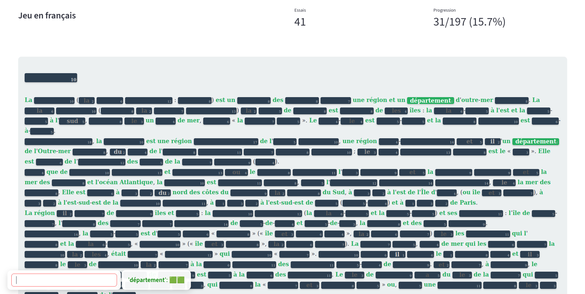

# Unlimited Pedantix

This game is an offline version of [Pedantix](https://pedantix.certitudes.org/), a daily word puzzle by [Enigmatix](https://x.com/enigmathix).

In the original, a random Wikipedia page is selected each day. Players guess words, which are revealed if they appear in the article; similar words also provide clues. However, you can only play one page per day.

To overcome this limitation, I created my own version: **Unlimited Pedantix**, offering endless puzzles to solve.

Another interesting feature of this game is that after each game, we can vote on which page we would have liked to play. This vote is then saved and used by a classifier to select more relevant articles in subsequent games.

<div style="text-align: center;">
  
</div>

## Installation

```bash
python3 -m venv venv
source venv/bin/activate
pip install -r requirements.txt
```

## Usage

Simply run:
```bash
streamlit run src/web_viewer.py
```
A web navigator window will open with the game in it.

## Technical implemantation

To ensure engaging gameplay, the random Wikipedia page is selected through a quality-filtering process to avoids obscure pages while maintaining variety:
- An initial pool of 150 random articles is fetched.
- The 20 articles with the highest number of visits over the past 30 days are then selected.
- A classifier trained on the user's tastes is then used to select the more relevant article.

*The different parameters can be adjusted in `src/config.py`.*

To detect semantically similar words, this implementation uses FastText instead of Word2Vec (used in the original game), offering two significant advantages:
- Performance: Faster processing and more efficient memory usage
- Vocabulary Coverage: Handles out-of-vocabulary words through subword embeddings, eliminating vocabulary limitations entirely

Typical FastText models weigh in at around 7GB, which is way too much for the needs of the project. To address this, I use a compressed version from [Zenodo](https://zenodo.org/records/4905385) by Bernhard Liebl. These embeddings were originally obtained from [fasttext.cc](https://fasttext.cc/docs/en/crawl-vectors.html) and compressed using the [compress-fasttext](https://github.com/avidale/compress-fasttext) library. The resulting model is just 20MB and downloads automatically when needed. We do lose some precision, especially on technical pages, but considering it's 350 times smaller than the original, that's a pretty good trade-off.

*A parameter can be changed in `src/config.py` to use classic fasttext model instead*
