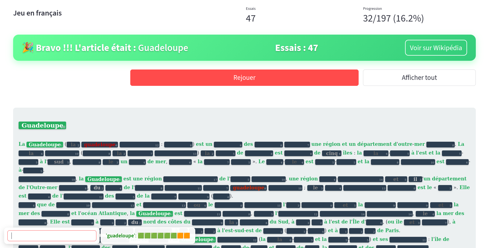

# Unlimited Pedantix

This game is an offline version of [Pedantix](https://pedantix.certitudes.org/), a daily word puzzle by [Enigmatix](https://x.com/enigmathix).

In the original, a random Wikipedia page is selected each day. Players guess words, which are revealed if they appear in the article; similar words also provide clues. However, you can only play one page per day.

To overcome this limitation, I created my own version: **Unlimited Pedantix**, offering endless puzzles to solve.

## Gameplay

Here’s what the game looks like while playing:


And here’s the screen after winning:




## Installation

```bash
python3 -m venv venv
source venv/bin/activate
pip install -r requirements.txt
```

## Usage

Simply run:
```bash
streamlit run src/main.py
```
A web navigator window will open with the game in it.

## Technical impletmantation

To ensure engaging gameplay, the random Wikipedia page is selected through a quality-filtering process to avoids obscure pages while maintaining variety:
- An initial pool of 200 random articles is fetched.
- The system then selects the article with the highest number of visits over the past 30 days.

*The pool size and popularity metric can be adjusted in `src/config.py`.*

To detect semantically similar words, this implementation uses FastText instead of Word2Vec (used in the original game), offering two significant advantages:
- Performance: Faster processing and more efficient memory usage
- Vocabulary Coverage: Handles out-of-vocabulary words through subword embeddings, eliminating vocabulary limitations entirely